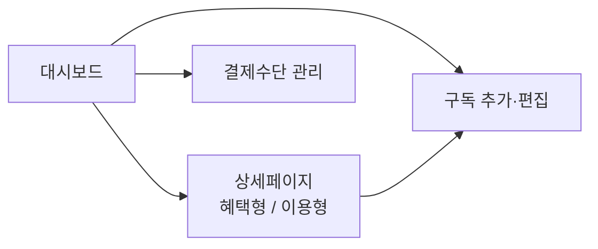

# 구독 관리 웹앱 PRD

Sep 25, 2026 · @garden

## 개요와 목표

나 혼자 쓰는 정기구독 관리 웹앱이다. 매달 실제로 얼마를 내는지, 구독마다 본전을 뽑고 있는지를 한 화면에서 확인하는 것이 목표다.

- **사용자**: 본인 1명. 로그인·권한 관리 없음
- **해결할 문제**: 구독이 여러 결제수단에 흩어져 있어 총액을 모르고, 무료체험 자동결제를 놓치고, 쿠팡와우·네이버플러스 같은 혜택형 구독을 절반도 못 쓴다
- **성공 기준**: 대시보드 첫 화면에서 월 실부담 총액과 다음 결제 3건이 바로 보인다. 모든 구독에 본전 달성률이 표시된다

## 핵심 기능

MVP는 아래 7개 기능이다. 모두 수동 입력 기반이며 외부 서비스 연동은 없다.

1. **구독 등록·편집·삭제**
   - 입력: 서비스명, 카테고리, 정가, 결제주기, 다음 결제일, 결제수단, 상태(구독중 / 무료체험 / 해지예정), 상세 유형
2. **결제주기와 월 환산**
   - 주기는 1개월, 3개월, 6개월, 12개월 또는 직접 입력(N개월)
   - 주기가 1개월보다 길면 금액을 주기로 나눠 월 환산액으로도 표시 (예: 연 60,000원 → 월 5,000원)
   - 다음 결제일이 지나면 주기만큼 자동으로 다음 날짜로 넘어감
3. **결제 알림과 무료체험**
   - 결제 D-3, D-1에 대시보드 상단 배너로 표시
   - 무료체험은 종료일과 종료 후 결제될 금액을 입력하고, 목록에서 체험 배지와 D-day로 강조
4. **실부담액**
   - 할인: 정액(원) 또는 정률(%) 입력, 예: 카드 청구할인, 통신사 제휴
   - 공유: 총 인원 수 입력 시 1/n, 또는 내가 내는 금액을 직접 입력
   - 정가와 실부담액을 함께 보여줌
5. **월 총액**
   - 모든 활성 구독의 월 환산 실부담액 합계와 연 환산 합계
   - 결제수단별 소계
6. **상세페이지 2유형**
   - **혜택 체크리스트형** (쿠팡와우, 네이버플러스 등): 혜택 항목마다 이름, 리셋 주기(매월 / 없음), 1회 사용 시 추정 가치(원)를 등록. 사용할 때마다 날짜와 실제 절약액을 기록하고, 매월 1일 체크 상태가 초기화됨
   - **이용 추적형** (유튜브 프리미엄, 클라우드 등): 측정 단위를 횟수 또는 이용시간(분) 중 선택. 이용시간은 휴대폰 스크린타임을 보고 직접 입력 (웹앱은 휴대폰 앱 사용시간을 자동으로 읽을 수 없음)
7. **본전 달성률**
   - 모든 구독 카드와 상세페이지에 이번 달 달성률(%)을 게이지로 표시
   - 계산식은 데이터 모델 섹션 참고

## 화면 구성

화면은 4개이며 모바일(폭 360px) 우선, 데스크탑에서는 카드 그리드로 넓어진다.



| 화면 | 주요 요소 |
| --- | --- |
| 대시보드 | 상단: 월 실부담 총액(큰 숫자), 연 환산액, 결제 D-3 이내·무료체험 종료 임박 배너. 본문: 구독 카드 리스트(서비스명, 월 실부담액, 결제수단, 다음 결제일, 본전 달성률 바), 정렬(결제일순 / 금액순 / 달성률순) |
| 상세페이지 (혜택형) | 달성률 게이지, 이번 달 절약액 vs 월 실부담액, 혜택 체크리스트(체크 시 절약액 입력 모달), 사용 기록 목록 |
| 상세페이지 (이용형) | 달성률 게이지, 이번 달 누적 횟수·시간, 빠른 기록 버튼(+1회 / +30분 등), 회당·시간당 비용, 일별 기록 목록 |
| 구독 추가·편집 | 기본 정보, 결제, 할인·공유, 상세 유형과 본전 기준 입력 폼 |
| 결제수단 관리 | 결제수단 목록(별칭, 종류, 끝 4자리), 수단별 월 소계와 연결된 구독 |

**디자인 원칙**: 밝은 배경에 포인트 컬러 1개, 금액은 크게. 달성률 색은 50% 미만 빨강, 50\~99% 노랑, 100% 이상 초록. 

## 데이터 모델과 계산 규칙

엔티티는 5개다. 금액은 모두 원 단위 정수로 저장한다.

| 엔티티 | 필드 |
| --- | --- |
| Subscription | id, name, category, listPrice, cycleMonths, nextBillingDate, paymentMethodId, status(active / trial / canceling), trialEndDate, priceAfterTrial, discountType(none / amount / percent), discountValue, shareCount, myShareOverride, detailType(benefit / usage), usageUnit(count / minutes), usageTarget, memo |
| PaymentMethod | id, nickname, type(card / account / easypay), last4 |
| Benefit | id, subscriptionId, name, resetCycle(monthly / none), estimatedValue |
| BenefitUse | id, benefitId, subscriptionId, date, savedAmount, note |
| UsageLog | id, subscriptionId, date, amount(횟수 또는 분) |

**계산 규칙**

- 주기당 실부담액 = (정가 − 할인) ÷ 공유 인원. myShareOverride가 있으면 그 값을 사용
- 월 환산 실부담액 = 주기당 실부담액 ÷ cycleMonths, 원 단위 반올림
- 혜택형 달성률 = 이번 달 절약액 합계 ÷ 월 환산 실부담액 × 100
- 이용형 달성률 = 이번 달 이용량 ÷ usageTarget × 100. usageTarget은 "이만큼 쓰면 본전"이라고 내가 정한 값 (예: 월 20시간)
- 월 총액은 active만 합산. trial은 "체험 종료 후 추가될 금액"으로 따로 표시, canceling은 제외
- "이번 달"은 달력 기준 1일\~말일

## 기술 요구사항과 범위 밖

PC와 휴대폰에서 같은 데이터를 봐야 하므로 브라우저 저장소가 아닌 클라우드 DB에 저장한다.

**기술 요구사항**

- 스택: React + TypeScript + Vite + Tailwind CSS
- 저장소: Supabase(무료 티어) 등 클라우드 DB. 개인용이라 이메일 매직링크 로그인 1계정만 허용
- 배포: Vercel 또는 Netlify 무료 플랜
- 반응형: 360px 모바일부터 데스크탑까지
- 한국어 UI, 금액은 천 단위 쉼표와 "원" 표기, 날짜는 YYYY.MM.DD
- 보안: 카드 전체 번호, CVC, 계좌 비밀번호는 입력란 자체를 만들지 않음. 결제수단은 별칭과 끝 4자리만

**범위 밖 (MVP에서 하지 않음)**

- 카드사·은행·간편결제 자동 연동
- 휴대폰 앱 이용시간 자동 수집
- 콘텐츠 시청 기록(로그형 상세페이지)
- 다중 사용자, 공유 파티원 계정
- 이메일·푸시 알림 (앱 안 배너만)

## 바이브코딩 프롬프트

한 번에 전부 만들게 하지 말고 단계별로 나눠 요청한다. 먼저 시작 프롬프트에 이 PRD 전체를 붙여넣고, 각 단계가 동작하는 걸 확인한 뒤 다음 단계로 넘어간다.

**시작 프롬프트 (대화 첫 메시지)**

```text
너는 시니어 프론트엔드 개발자야. 아래 PRD대로 개인용 구독 관리 웹앱을 만들 거야.

작업 규칙:
- 내가 단계별로 요청할 거야. 요청한 단계만 구현하고 다음 단계를 미리 만들지 마.
- PRD에 없는 기능은 추가하지 말고, 애매한 부분은 구현 전에 질문해.
- 코드는 파일 경로와 함께 전체 내용을 줘. 수정할 때는 바뀐 파일만.
- 각 단계 끝에 실행 방법과 내가 직접 확인할 체크리스트를 알려줘.
- 금액 계산 로직은 UI와 분리된 순수 함수로 작성해.

[여기에 PRD 전체 붙여넣기]

이해했으면 폴더 구조와 단계별 구현 계획만 먼저 제안해줘. 코드는 아직 쓰지 마.
```

**1단계: 프로젝트 셋업과 계산 로직**

```text
1단계를 진행해줘. Vite + React + TypeScript + Tailwind 프로젝트를 셋업하고, PRD의 데이터 모델을 TypeScript 타입으로 정의해줘. 계산 규칙(주기당 실부담액, 월 환산액, 월 총액, 결제수단별 소계, 혜택형·이용형 달성률, 다음 결제일 자동 갱신)을 순수 함수로 만들고 Vitest 테스트를 작성해줘. 데이터는 우선 메모리의 샘플 데이터(넷플릭스 공유, 쿠팡와우, 네이버플러스, 유튜브 프리미엄, 연 결제 1개, 무료체험 1개)로 해줘.
```

**2단계: 구독·결제수단 등록**

```text
2단계를 진행해줘. 구독 추가·편집·삭제 폼과 결제수단 관리 화면을 만들어줘. 폼은 PRD의 모든 Subscription 필드를 다루고, 상세 유형을 고르면 해당 입력(혜택 항목 또는 측정 단위와 본전 기준)이 나타나야 해. 결제수단은 별칭, 종류, 끝 4자리만 받아. 입력 검증(음수 금액, 빈 이름, 공유 인원 0 등)을 넣어줘.
```

**3단계: 대시보드**

```text
3단계를 진행해줘. PRD 화면 구성대로 대시보드를 만들어줘. 상단에 월 실부담 총액과 연 환산액, 결제 D-3 이내와 무료체험 종료 임박 배너. 아래에 구독 카드 리스트와 정렬 옵션. 카드에는 달성률 바를 PRD의 색 규칙대로 표시해. 360px 모바일 기준으로 먼저 디자인해줘.
```

**4단계: 상세페이지 (혜택 체크리스트형)**

```text
4단계를 진행해줘. 혜택 체크리스트형 상세페이지를 만들어줘. 혜택을 체크하면 절약액 입력 모달(추정 가치가 기본값)이 뜨고 BenefitUse로 저장돼. 매월 리셋되는 혜택은 새 달이 되면 체크가 풀려야 해. 이번 달 절약액 vs 월 실부담액과 달성률 게이지, 사용 기록 목록을 보여줘.
```

**5단계: 상세페이지 (이용 추적형)**

```text
5단계를 진행해줘. 이용 추적형 상세페이지를 만들어줘. 측정 단위가 횟수면 +1 버튼, 분이면 +15분/+30분/+60분 버튼과 직접 입력을 제공해. 이번 달 누적량, 달성률 게이지, 회당 또는 시간당 비용, 일별 기록 목록(수정·삭제 가능)을 보여줘.
```

**6단계: 클라우드 저장과 배포**

```text
6단계를 진행해줘. 메모리 샘플 데이터를 Supabase로 교체해줘. 테이블 생성 SQL, Row Level Security 정책(내 계정만 접근), 이메일 매직링크 로그인을 포함해. Vercel 배포 방법과 필요한 환경변수를 단계별로 알려줘.
```

**마지막: 점검**

```text
지금까지 코드 전체를 PRD와 비교해서 빠진 요구사항, 계산 오류 가능성(반올림, 월말 날짜, 윤년), 모바일 레이아웃 문제를 목록으로 정리해줘. 수정은 내가 승인한 것만 해.
```
